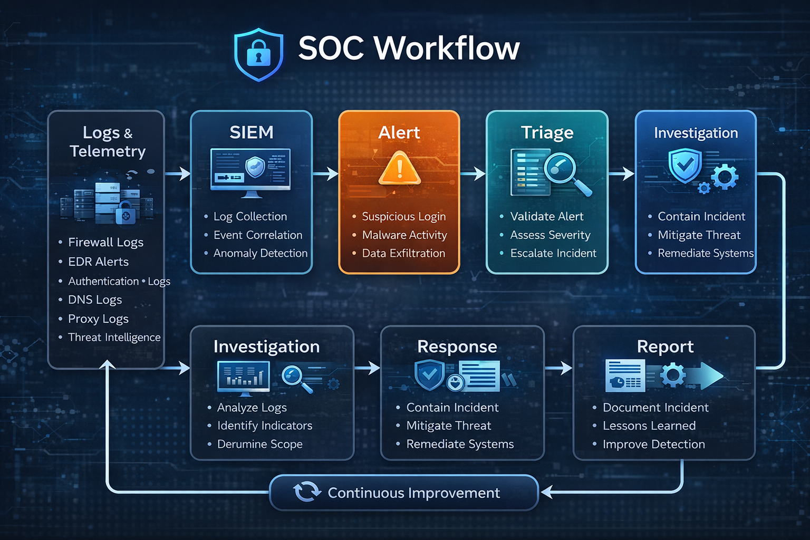

# 🧠 SIEM Fundamentals for SOC Operations

## 1. What is a SIEM?
A Security Information and Event Management (SIEM) system is a centralized platform that collects, normalizes, correlates, and analyzes security events from multiple sources across an organization.

In a SOC environment, the SIEM is not just a logging tool — it is the primary decision-making engine used to detect threats, investigate incidents, and support response actions.

---

## 2. Core Functions of a SIEM

### 🔹 Log Collection
The SIEM ingests logs from multiple sources, including:
- Operating systems (Windows / Linux)
- Network devices (Firewalls, IDS/IPS, VPN)
- Identity systems (Active Directory, Azure AD)
- Applications and databases
- Endpoint security tools (EDR)

Centralized log collection eliminates blind spots and enables cross-platform visibility.

---

### 🔹 Normalization
Different log sources generate data in different formats.
SIEM platforms normalize this data into a common structure, allowing analysts to query and correlate events consistently.

Without normalization, large-scale analysis becomes impractical.

---

### 🔹 Correlation
Correlation is the most critical function of a SIEM.

Rather than analyzing single events, the SIEM identifies **patterns of behavior** by linking related events together.

Example:
- Multiple failed logins
- Followed by a successful login
- From a new geographic location
- Outside normal working hours

Individually, these events may be benign.  
Together, they indicate potential account compromise.

---

### 🔹 Alerting
When correlation rules or analytics detect suspicious behavior, the SIEM generates alerts.

Effective alerting focuses on:
- Behavioral patterns
- Context-aware detection
- Reducing noise and false positives

A high volume of alerts does not mean effective security.

---

## 3. SIEM in Daily SOC Operations

SOC analysts rely on the SIEM to:
- Monitor real-time security alerts
- Investigate suspicious user or system behavior
- Correlate activity across endpoints, network, and identity
- Validate incidents before escalation
- Support incident response and reporting

The SIEM serves as the primary interface between raw telemetry and analyst decision-making.

---

## 4. False Positives vs True Positives

### ❌ False Positives
False positives are alerts triggered by legitimate activity that appears suspicious.

Common causes:
- Poorly tuned detection rules
- Lack of environmental context
- Business processes not accounted for

Too many false positives lead to analyst fatigue and missed real threats.

---

### ✅ True Positives
True positives represent confirmed malicious or unauthorized activity.

Characteristics:
- Consistent with known attack techniques
- Correlated across multiple data sources
- Validated through investigation

SOC maturity depends on increasing true positive rates while minimizing false positives.

---

## 5. SIEM Use Cases
A **use case** defines how the SIEM detects a specific threat scenario.

Each use case includes:
- Threat scenario description
- Relevant log sources
- Detection logic
- Expected alert behavior
- Known false positives

Well-designed use cases are more valuable than generic rules.

---

## 6. SIEM and MITRE ATT&CK
Modern SOCs map SIEM detections to the MITRE ATT&CK framework.

This allows analysts to:
- Understand attacker tactics and techniques
- Identify coverage gaps
- Improve detection strategy
- Communicate threats using a common language

Detection is not just about alerts — it is about understanding adversary behavior.

---

## 7. Limitations of SIEM
A SIEM alone cannot prevent attacks.

Limitations include:
- Dependence on log quality
- Delayed detection for stealthy attacks
- Limited context without EDR or threat intelligence

A SIEM must be integrated with other security controls to be effective.

---

## 8. SIEM Analyst Mindset
An effective SOC analyst:
- Does not blindly trust alerts
- Investigates behavior, not single events
- Understands business context
- Continuously improves detection logic

In this project, SIEM concepts are applied through realistic detection use cases, investigations, and DFIR scenarios.
