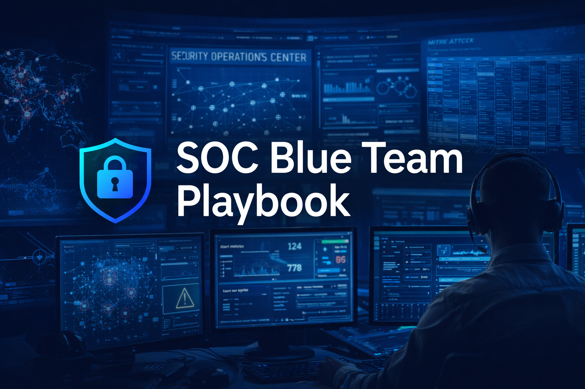

# 🛡️ SOC Blue Team Playbook

An end-to-end Security Operations Center (SOC) & Blue Team project simulating real-world cyber security detection, incident response, and digital forensics investigations.

---

## 🎯 Project Objectives
- Simulate real SOC monitoring and alert triage
- Build detection use cases and threat hunting logic
- Perform structured incident response and DFIR investigations
- Document incidents using professional SOC reporting standards

---

## 🧠 Project Structure
0x01-Foundations → SOC concepts, SIEM, MITRE ATT&CK
0x02-Detection → Alerts, use cases, Sigma rules
0x03-Incident-Response → Playbooks & response workflows
0x04-DFIR → Realistic investigation case studies
0x05-Threat-Hunting → Hypothesis-driven threat hunting
0x06-Reports → Executive & technical reporting
Assets → Diagrams & visuals

---

## 🛠️ Tools & Frameworks
- SIEM (Splunk / Microsoft Sentinel – simulated)
- Windows Event Logs
- PowerShell Logging
- EDR Telemetry
- MITRE ATT&CK Framework
- Sigma Detection Rules

---

## 🔍 DFIR Case Studies
| Case | Scenario |
|-----|---------|
| Case 01 | Malware Infection |
| Case 02 | Insider Threat |
| Case 03 | Ransomware Attack |
| Case 04 | Advanced Insider Threat |

---

## 📌 Key Skills Demonstrated
- SOC Alert Analysis & Triage
- Log Analysis (Windows / PowerShell)
- Incident Response & Containment
- Digital Forensics & Timeline Analysis
- Threat Hunting
- Professional Security Reporting

---

## 🚀 Why This Project Matters
This project demonstrates hands-on SOC analyst skills beyond certifications, focusing on real-world investigation mindset, documentation, and decision-making.

---

## 🔗 Author
- LinkedIn: www.linkedin.com/in/ِabdullah-alharbi-030577276
